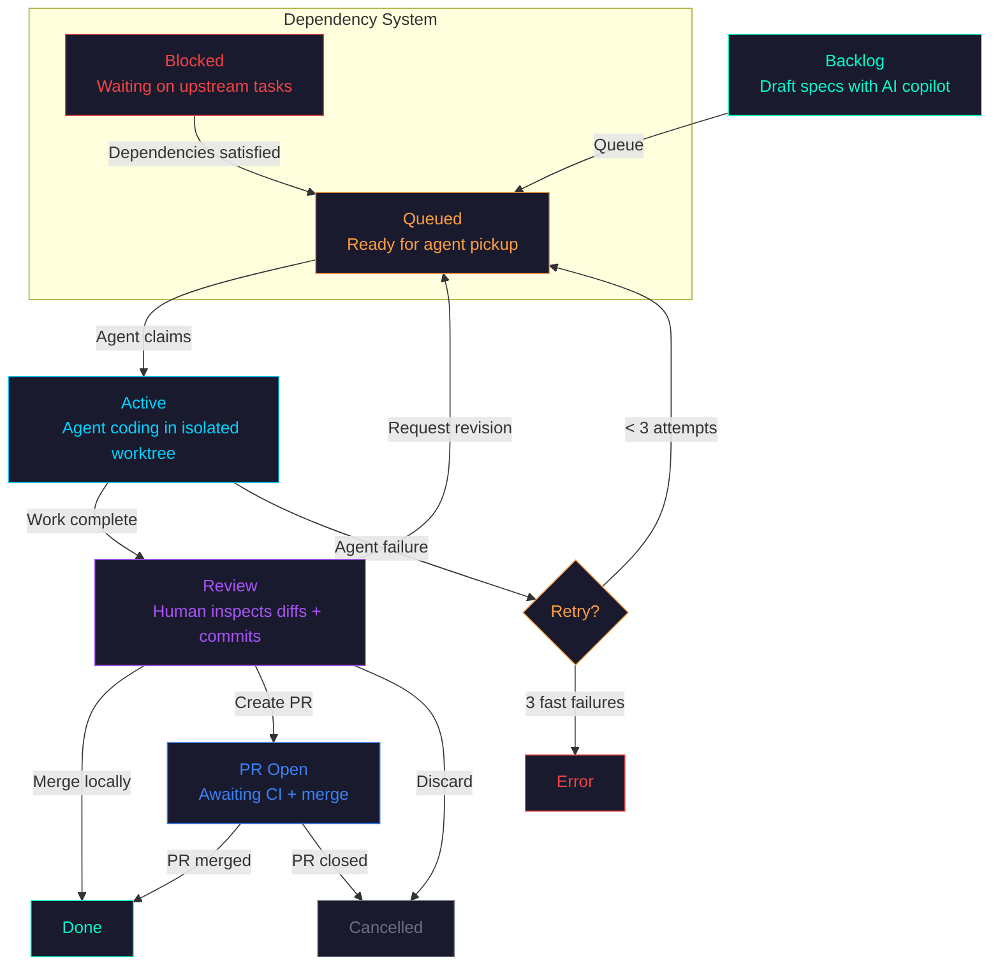
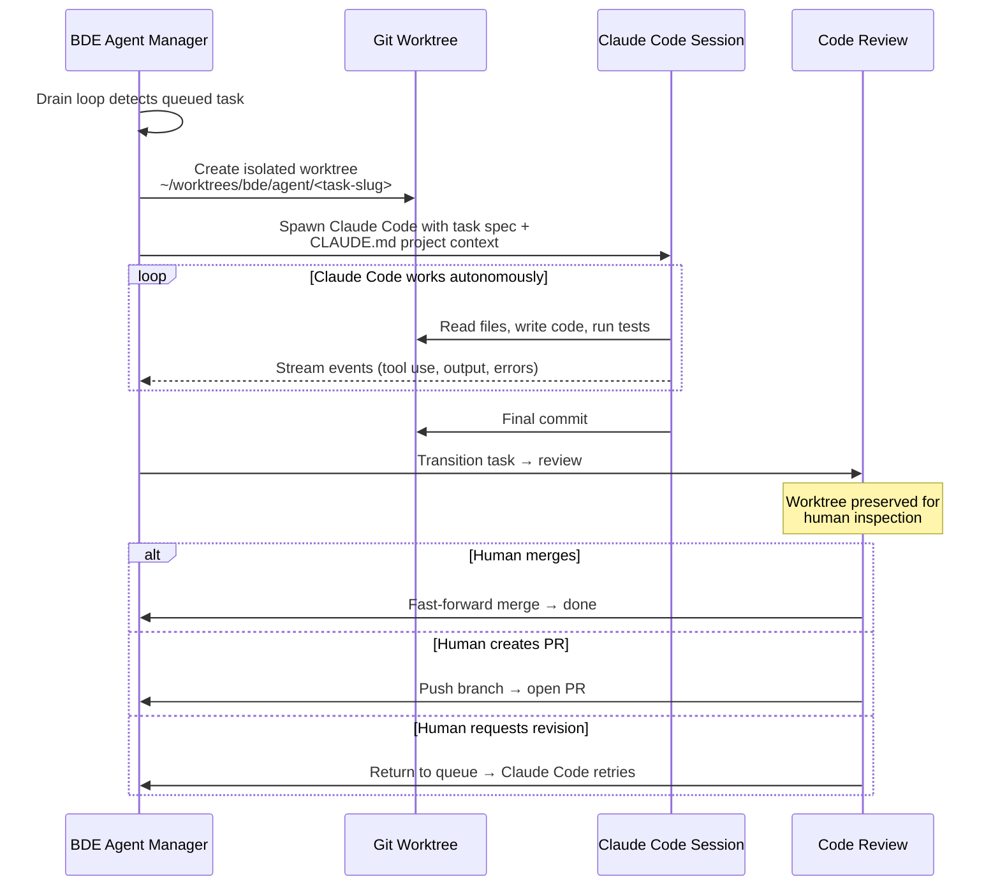
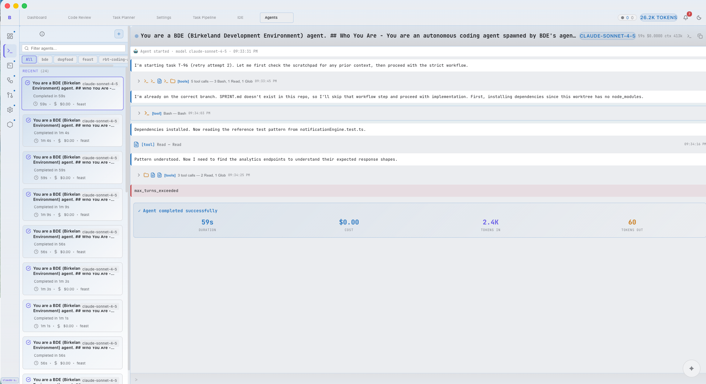
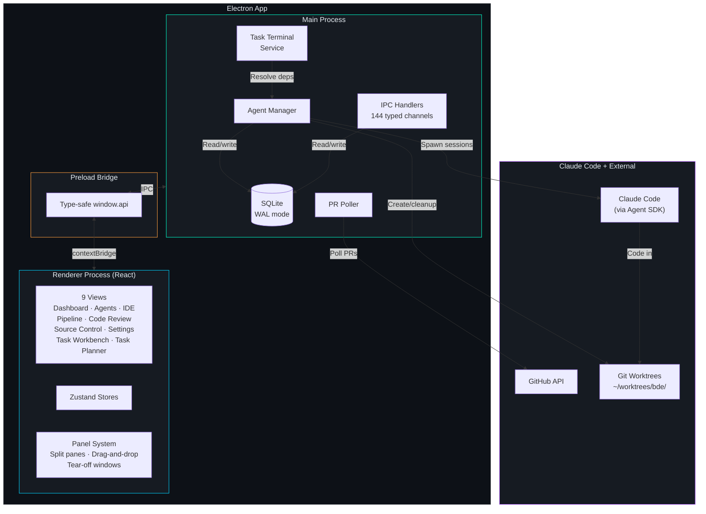
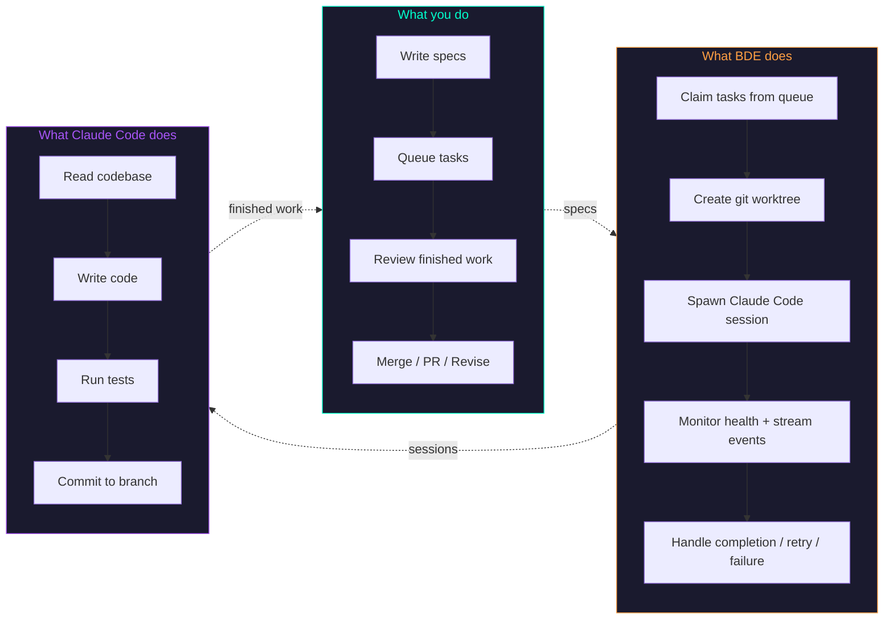

<div align="center">

# BDE

**A steering system for Claude Code at scale.**

Claude Code is a powerful coding agent. BDE is the desktop app that turns it into a managed engineering pipeline — orchestrating multiple Claude Code sessions in parallel, each working in isolated git worktrees, with human review gates before anything touches your codebase.

You write specs. BDE queues them, spawns Claude Code sessions, monitors progress, and presents finished work for review. You stay in control. Claude Code does the building.

[Getting Started](#getting-started) | [How It Works](#how-it-works) | [Features](#features) | [Architecture](#architecture) | [Contributing](#contributing)

<br/>

![BDE Dashboard — pipeline health, status counters, cost tracking, and live activity feed]

*Dashboard: 6 active Claude Code sessions, 21 queued, 225 completed — all visible at a glance.*

</div>

---

## Why BDE?

Claude Code is already great at writing code. What it doesn't have out of the box is:

- **A task queue** — feed it 20 specs and walk away
- **Parallel execution** — multiple Claude Code sessions running simultaneously on different tasks
- **Git worktree isolation** — each session works on its own branch in its own directory, your working tree stays clean
- **A review gate** — nothing merges without human approval
- **Dependency management** — "task B waits for task A" with automatic blocking and unblocking
- **Observability** — real-time pipeline view, cost tracking, event streams across all sessions
- **Retry and failure handling** — automatic retries, fast-fail detection, watchdog timers

BDE adds all of this. It doesn't replace Claude Code — it wraps it in the infrastructure needed to run it as a development pipeline.

### The Cognitive Load Problem

Running AI agents manually is surprisingly exhausting. You're context-switching between terminal tabs, remembering which branch is which, mentally tracking what depends on what, catching failures by accident, and trying to review diffs while three other sessions are still running. The agents are doing the coding — but *you're* doing all the project management in your head.

That's the kind of invisible overhead that leads to burnout. Not from the work itself, but from juggling the meta-work around it.

BDE externalizes all of that. The Dashboard shows you pipeline health at a glance — how many sessions are active, what's blocked, what just finished, what failed. The Sprint Pipeline gives you a single visual flow of every task through every stage. Cost charts show spend trends so you're not surprised. Activity feeds surface errors the moment they happen, not when you remember to check.

The goal is simple: **you should be able to look at one screen and know exactly what's happening across all your concurrent work** — then make decisions (review, retry, reprioritize) without holding any of it in your head.

| | Using Claude Code directly | Using Claude Code via BDE |
|---|---|---|
| **Sessions** | One at a time, manually started | Fleet running in parallel, auto-claimed from queue |
| **Isolation** | Works in your current checkout | Each session gets its own git worktree |
| **Lifecycle** | Open terminal → chat → hope it works | Spec → queue → execute → review → merge |
| **After completion** | You manually check the diff, commit, PR | Code Review Station: inspect diffs, merge/PR/revise in one click |
| **Coordination** | You remember which tasks depend on which | Declarative hard/soft dependencies with auto-resolution |
| **When it fails** | You notice, restart manually | Auto-retry (up to 3x), fast-fail detection, watchdog kill |
| **Observability** | Scroll through terminal output | Dashboard, pipeline view, cost charts, event streams |
| **Spend visibility** | No idea what your agents cost | Cost dashboard with per-run, hourly, and daily analytics |
| **Cognitive load** | You track everything in your head | One screen shows all concurrent work, decisions, and status |

---

## How It Works

### The Task Lifecycle

Every piece of work flows through a structured pipeline. Tasks start as ideas and end as merged code — with human review gates at every critical point.

**The short version, in four steps:**

1. **Define tasks and dependencies** — Draft specs in Task Workbench, set hard/soft dependencies so agents tackle prerequisites first.
2. **BDE spawns Claude Code in isolation** — Each task gets its own Claude Code session in its own git worktree. Sessions run in parallel without stepping on each other.
3. **Sessions land in the Review queue** — When a session finishes, its worktree is preserved and the task moves to `review`. No auto-push, no surprise PRs.
4. **You decide what ships** — Inspect diffs in Code Review Station, then merge locally, open a PR, request a revision, or discard.



### What Happens When a Task Runs

Each task becomes a Claude Code session. BDE handles everything around it:



> **BDE doesn't have its own AI.** Every agent is a Claude Code session spawned via the [Claude Agent SDK](https://docs.anthropic.com/en/docs/agents-and-tools/claude-code/sdk). BDE's job is steering: what runs, where it runs, when it retries, and what happens with the output.

---

## Features

### Task Workbench — Plan Before You Build
Draft task specs with an AI copilot, define dependencies between tasks, and run readiness checks before queuing. The copilot helps refine specs through conversation. A synthesizer can generate structured specs from codebase context.

### Sprint Pipeline — Watch Work Flow
Real-time monitoring of tasks flowing through stages. Seven visual buckets (backlog, todo, blocked, in-progress, awaiting review, done, failed) give you instant visibility into your entire pipeline.

### Agent Manager — Orchestrating Claude Code Sessions
The core of BDE. Watches the task queue, spawns Claude Code sessions in isolated git worktrees, monitors their health, and handles the full lifecycle from start to review.

- **Parallel execution** — configurable WIP limit for concurrent Claude Code sessions
- **Worktree isolation** — each session gets its own branch in its own directory
- **Watchdog timers** — per-task runtime limits (default 1 hour)
- **Smart retry** — up to 3 attempts, with fast-fail detection (3 failures within 30s = stop trying)
- **Project context** — every session inherits your `CLAUDE.md` files, so agents know your conventions


*Agents view: 5 active Claude Code sessions running in parallel. Each shows live tool calls, edits, and bash commands as they happen.*

### Code Review Station — Human in the Loop
Agents don't push directly to main. Every completed task lands in a review queue where you inspect diffs, browse commits, read the agent's conversation log, then choose: merge locally, create a PR, request a revision, or discard.

### Task Dependencies — Declarative Coordination
Tasks can declare `hard` or `soft` dependencies on other tasks:
- **Hard** — downstream blocks until upstream succeeds
- **Soft** — downstream unblocks regardless of upstream outcome

Cycle detection at creation time. Automatic resolution when tasks complete. No manual coordination needed.

### Dev Playground — Visual Output in the IDE
When agents write HTML files, BDE renders them inline — sandboxed with DOMPurify. Build CSS theme explorers, component playgrounds, data visualizations, and architecture diagrams without leaving the app.

### Integrated IDE
Monaco editor with file explorer, multi-tab interface, and integrated terminal. Syntax highlighting, dirty state tracking, keyboard shortcuts. Not a replacement for VS Code — a companion for quick edits and agent output inspection.

### Source Control
Git staging, committing, and pushing across multiple repos. Inline diff previews, branch selection, and error handling with retry.

### Cost Tracking — Know What Your Agents Cost
Every Claude Code session's token usage and cost are logged to `cost_events`. The Dashboard surfaces per-run, hourly, and daily spend trends so you can spot expensive tasks, compare models, and catch runaway loops before the bill does. No external billing integration needed — the data comes straight from SDK usage events.

### Dashboard
Aggregated metrics at a glance: active/queued/blocked task counts, hourly completion charts, cost-per-run trends, success rate, and recent activity feed. Dark and light themes supported.

<p align="center">


</p>

*Left: dark neon theme. Right: light theme. Same data, same layout — pick what works for you.*

---

## Architecture

Local-first, open architecture, clean code. No black boxes — your tasks, diffs, costs, and events all live in a SQLite file on your machine.



### Tech Stack

| Layer | Technology |
|-------|-----------|
| Framework | Electron + electron-vite |
| Frontend | React, TypeScript, Zustand |
| Editor | Monaco (ESM, not CDN) |
| Database | SQLite (better-sqlite3, WAL mode) |
| AI Engine | Claude Code (spawned via @anthropic-ai/claude-agent-sdk) |
| Icons | lucide-react |
| Layout | react-resizable-panels |
| Testing | Vitest (unit + integration), Playwright (E2E) |
| CI | GitHub Actions (typecheck + lint + coverage-gated tests) |

### Data Model

All state lives in a local SQLite database at `~/.bde/bde.db`. No cloud dependencies for core functionality.

| Table | Purpose |
|-------|---------|
| `sprint_tasks` | Task specs, status, dependencies, PR links, agent assignments |
| `agent_runs` | Agent execution audit trail — model, status, timing |
| `agent_events` | Streaming agent events (tool use, output, errors) |
| `cost_events` | Token usage and cost tracking per agent run |
| `task_changes` | Field-level audit trail on every task mutation |
| `settings` | Key-value app configuration |

---

## Getting Started

### Prerequisites

- **Node.js** v22+
- **Claude Code CLI** — installed and authenticated (`claude login`)
- **Git** and **GitHub CLI** (`gh`)
- macOS (Apple Silicon recommended; Intel supported)

### Install

```bash
git clone https://github.com/RyanJBirkeland/BDE.git
cd bde
npm install
npm run dev
```

On first launch, BDE checks for Claude Code authentication and guides you through setup.

### Build for Production

```bash
npm run build:mac    # → release/BDE-*.dmg (unsigned)
```

> **Note:** The app is unsigned. Right-click → Open to bypass macOS Gatekeeper on first launch.

### Run Tests

```bash
npm test             # Unit tests (vitest)
npm run test:main    # Main process integration tests
npm run test:e2e     # E2E tests (requires built app)
npm run typecheck    # TypeScript checking
npm run lint         # ESLint
```

---

## Views at a Glance

| View | Shortcut | What it does |
|------|----------|-------------|
| Dashboard | `Cmd+1` | Pipeline health, metrics, activity feed |
| Agents | `Cmd+2` | Spawn and interact with AI agents |
| IDE | `Cmd+3` | Monaco editor + file explorer + terminal |
| Task Pipeline | `Cmd+4` | Real-time task execution monitoring |
| Code Review | `Cmd+5` | Review agent diffs before merging |
| Source Control | `Cmd+6` | Git staging, commits, push |
| Settings | `Cmd+7` | 9 config tabs (connections, repos, agents, appearance, etc.) |
| Task Planner | `Cmd+8` | Multi-task workflow planning |
| Task Workbench | `Cmd+0` | Spec drafting with AI copilot + readiness checks |

The panel system supports split panes, drag-and-drop docking, and tear-off windows for multi-monitor setups.

---

## Session Types

BDE spawns Claude Code in five different modes, depending on the context:

| Type | Interactive | Worktree | What it does |
|------|-----------|----------|----------|
| **Pipeline** | No | Isolated | Autonomous task execution from the sprint queue |
| **Adhoc** | Yes (multi-turn) | Repo dir | User-spawned one-off Claude Code sessions |
| **Assistant** | Yes (multi-turn) | Repo dir | Conversational help and recommendations |
| **Copilot** | Yes (chat) | None | Text-only spec drafting in Task Workbench |
| **Synthesizer** | No | None | Structured spec generation from codebase context |

All sessions inherit your project knowledge from `CLAUDE.md` files — same as running Claude Code in your terminal, but managed.

---

## The Mental Model

Think of it like this:



**Claude Code is the engine. BDE is the steering system.** You wouldn't manually start 8 terminal sessions, create worktrees, track which tasks depend on which, retry failures, and review diffs across branches. BDE does that so you can focus on specs and review.

---

## Project Structure

```
src/
  main/                  # Electron main process
    agent-manager/       #   Task orchestration, worktree management, retry logic
    agent-system/        #   Native agent personalities and skills
    data/                #   Repository pattern, audit trail
    handlers/            #   23 IPC handler modules
    services/            #   Task terminal service, dependency resolution
    db.ts                #   SQLite schema + migrations
  preload/               # Type-safe IPC bridge
  renderer/src/
    views/               # 9 top-level views
    stores/              # Zustand state management
    components/          # UI components (neon design system)
    hooks/               # Shared React hooks
    lib/                 # Utilities, constants, GitHub cache
  shared/                # Types + IPC channel definitions
docs/
  architecture.md        # Full architecture documentation
  BDE_FEATURES.md        # Detailed feature reference
```

---

## Contributing

BDE is in active development. If you're interested in contributing:

1. Fork the repo and create a feature branch (`feat/your-feature`)
2. Run `npm run typecheck && npm test && npm run lint` before committing
3. Keep PRs focused — one feature or fix per PR
4. No new npm packages without discussion in an issue first

See [CLAUDE.md](./CLAUDE.md) for detailed development conventions, gotchas, and architecture notes.

---

## License

MIT

---

<div align="center">

Built by [Ryan](https://github.com/RyanJBirkeland) — and yes, most of BDE was built by Claude Code sessions orchestrated through BDE itself.

</div>
