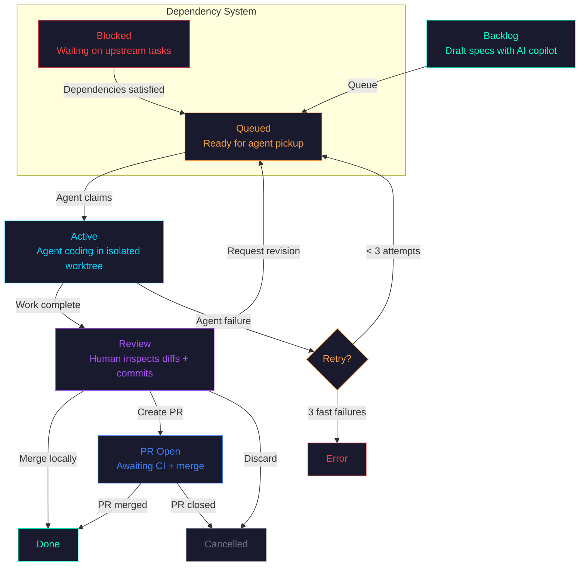
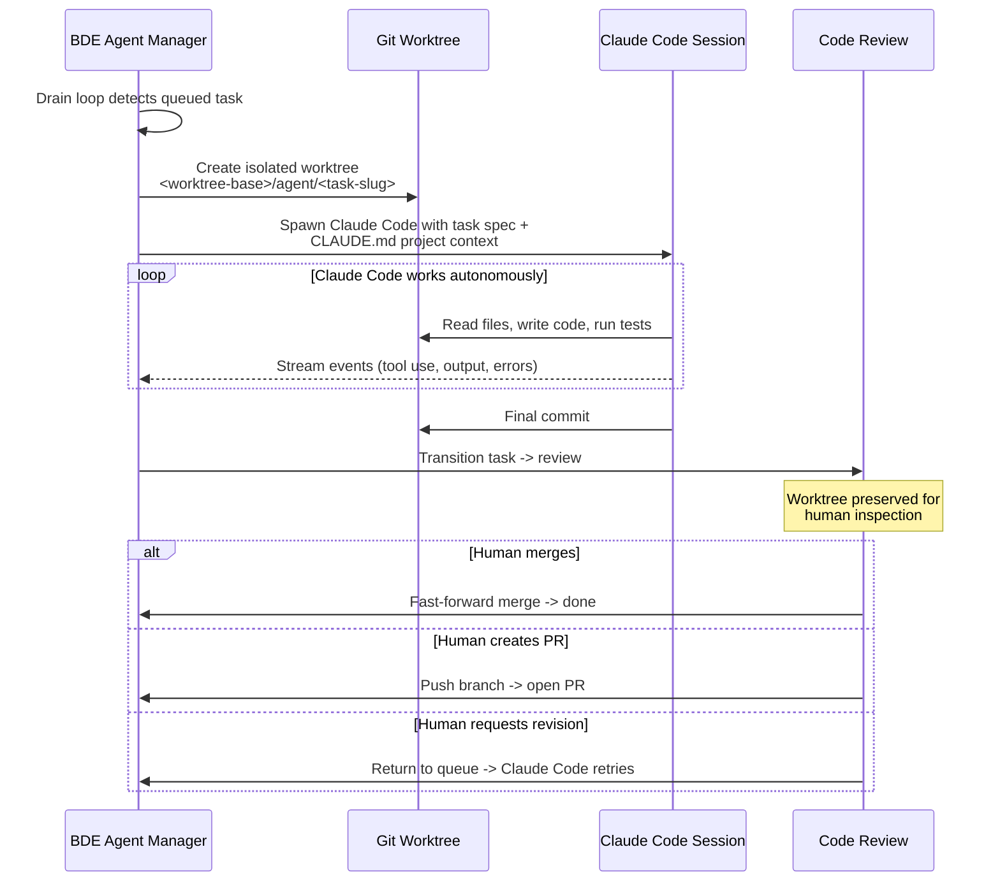
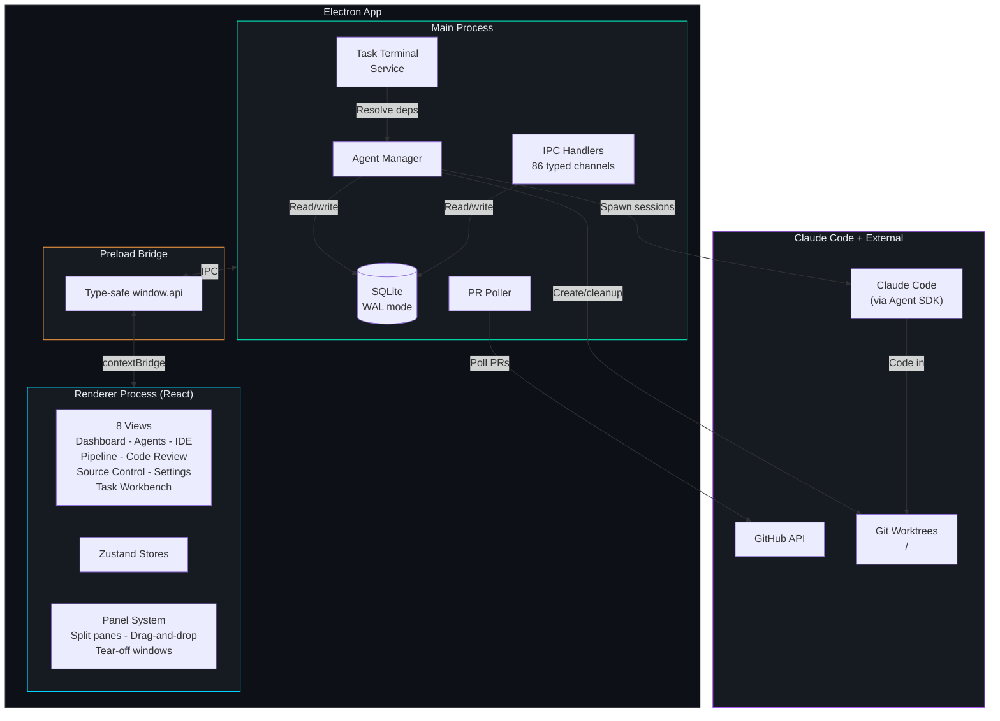
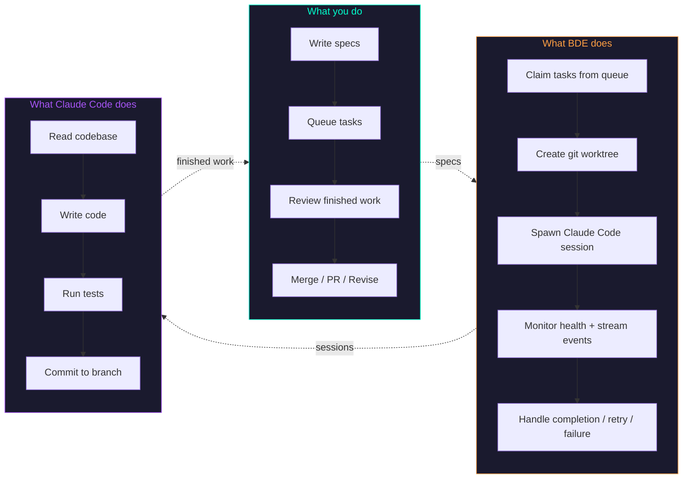

# BDE Development Guide

This is the development guide for BDE. For installation and quick start, see the [README](../README.md).

This document captures the architecture, internal mental model, and contributor reference material for working on BDE itself.

---

## How It Works

### The Task Lifecycle

Every piece of work flows through a structured pipeline. Tasks start as ideas and end as merged code — with human review gates at every critical point.

**The short version, in four steps:**

1. **Define tasks and dependencies** — Draft specs in Task Workbench, set hard/soft dependencies so agents tackle prerequisites first.
2. **BDE spawns Claude Code in isolation** — Each task gets its own Claude Code session in its own git worktree. Sessions run in parallel without stepping on each other.
3. **Sessions land in the Review queue** — When a session finishes, its worktree is preserved and the task moves to `review`. No auto-push, no surprise PRs.
4. **You decide what ships** — Inspect diffs in Code Review Station, then merge locally, open a PR, request a revision, or discard.



### What Happens When a Task Runs

Each task becomes a Claude Code session. BDE handles everything around it:



> **BDE doesn't have its own AI.** Every agent is a Claude Code session spawned via the [Claude Agent SDK](https://docs.anthropic.com/en/docs/agents-and-tools/claude-code/sdk). BDE's job is steering: what runs, where it runs, when it retries, and what happens with the output.

---

## Manual Claude Code vs BDE

| | Using Claude Code directly | Using Claude Code via BDE |
|---|---|---|
| **Sessions** | One at a time, manually started | Fleet running in parallel, auto-claimed from queue |
| **Isolation** | Works in your current checkout | Each session gets its own git worktree |
| **Lifecycle** | Open terminal -> chat -> hope it works | Spec -> queue -> execute -> review -> merge |
| **After completion** | You manually check the diff, commit, PR | Code Review Station: inspect diffs, merge/PR/revise in one click |
| **Coordination** | You remember which tasks depend on which | Declarative hard/soft dependencies with auto-resolution |
| **When it fails** | You notice, restart manually | Auto-retry (up to 3x), fast-fail detection, watchdog kill |
| **Observability** | Scroll through terminal output | Dashboard, pipeline view, cost charts, event streams |
| **Spend visibility** | No idea what your agents cost | Cost dashboard with per-run, hourly, and daily analytics |
| **Cognitive load** | You track everything in your head | One screen shows all concurrent work, decisions, and status |

---

## Architecture

Local-first, open architecture, clean code. No black boxes — your tasks, diffs, costs, and events all live in a SQLite file on your machine.



For the full architecture write-up, see [architecture.md](./architecture.md).

### Tech Stack

| Layer | Technology |
|-------|-----------|
| Framework | Electron + electron-vite |
| Frontend | React, TypeScript, Zustand |
| Editor | Monaco (ESM, not CDN) |
| Database | SQLite (better-sqlite3, WAL mode) |
| AI Engine | Claude Code (spawned via @anthropic-ai/claude-agent-sdk) |
| Icons | lucide-react |
| Layout | react-resizable-panels |
| Testing | Vitest (unit + integration), Playwright (E2E) |
| CI | GitHub Actions (typecheck + lint + coverage-gated tests) |

### Data Model

All state lives in a local SQLite database at `~/.bde/bde.db`. No cloud dependencies for core functionality.

| Table | Purpose |
|-------|---------|
| `sprint_tasks` | Task specs, status, dependencies, PR links, agent assignments |
| `agent_runs` | Agent execution audit trail — model, status, timing |
| `agent_events` | Streaming agent events (tool use, output, errors) |
| `cost_events` | Token usage and cost tracking per agent run |
| `task_changes` | Field-level audit trail on every task mutation |
| `settings` | Key-value app configuration |

### Cost tracking

Every Claude Code session's token usage and cost are logged to `cost_events`. The Dashboard surfaces per-run, hourly, and daily spend trends so you can spot expensive tasks, compare models, and catch runaway loops before the bill does. No external billing integration needed — the data comes straight from SDK usage events.

---

## Views at a Glance

| View | Shortcut | What it does |
|------|----------|-------------|
| Dashboard | `Cmd+1` | Pipeline health, metrics, activity feed |
| Agents | `Cmd+2` | Spawn and interact with AI agents |
| IDE | `Cmd+3` | Monaco editor + file explorer + terminal |
| Task Pipeline | `Cmd+4` | Real-time task execution monitoring |
| Code Review | `Cmd+5` | Review agent diffs before merging |
| Source Control | `Cmd+6` | Git staging, commits, push |
| Settings | `Cmd+7` | 9 config tabs (connections, repos, agents, appearance, etc.) |
| Task Workbench | — | Spec drafting with AI copilot + readiness checks |

The panel system supports split panes, drag-and-drop docking, and tear-off windows for multi-monitor setups.

---

## Session Types

BDE spawns Claude Code in five different modes, depending on the context:

| Type | Interactive | Worktree | What it does |
|------|-----------|----------|----------|
| **Pipeline** | No | Isolated | Autonomous task execution from the sprint queue |
| **Adhoc** | Yes (multi-turn) | Repo dir | User-spawned one-off Claude Code sessions |
| **Assistant** | Yes (multi-turn) | Repo dir | Conversational help and recommendations |
| **Copilot** | Yes (chat) | None | Text-only spec drafting in Task Workbench |
| **Synthesizer** | No | None | Structured spec generation from codebase context |

All sessions inherit your project knowledge from `CLAUDE.md` files — same as running Claude Code in your terminal, but managed.

---

## The Mental Model



**Claude Code is the engine. BDE is the steering system.** You wouldn't manually start 8 terminal sessions, create worktrees, track which tasks depend on which, retry failures, and review diffs across branches. BDE does that so you can focus on specs and review.

---

## Project Structure

```
src/
  main/                  # Electron main process
    agent-manager/       #   Task orchestration, worktree management, retry logic
    agent-system/        #   Native agent personalities and skills
    data/                #   Repository pattern, audit trail
    handlers/            #   17 IPC handler modules
    services/            #   Task terminal service, dependency resolution
    db.ts                #   SQLite schema + migrations
  preload/               # Type-safe IPC bridge
  renderer/src/
    views/               # 8 top-level views
    stores/              # Zustand state management
    components/          # UI components (neon design system)
    hooks/               # Shared React hooks
    lib/                 # Utilities, constants, GitHub cache
  shared/                # Types + IPC channel definitions
docs/
  architecture.md        # Full architecture documentation
  BDE_FEATURES.md        # Detailed feature reference
  DEVELOPMENT.md         # This file
```

---

## Build, Test, and Run

```bash
npm install              # Install dependencies
npm run dev              # Dev server with HMR
npm run build            # Type-check + production build (must pass before PR)
npm run typecheck        # TypeScript type checking (also runs in CI)
npm test                 # Unit tests via vitest
npm run test:main        # Main process integration tests
npm run test:coverage    # Unit tests + coverage threshold enforcement
npm run test:e2e         # E2E tests via Playwright (requires built app)
npm run lint             # ESLint
npm run format           # Prettier
npm run build:mac        # Build unsigned macOS arm64 DMG -> release/BDE-*.dmg
```

### CI

GitHub Actions runs on every push to `main` and every PR targeting `main`:

- `npm run lint` — must pass
- `npm run typecheck` — must pass
- `npm run test:coverage` — must pass (coverage thresholds enforced in vitest config)
- `npm run test:main` — must pass

All checks are required before merge.

### Pre-commit checklist

Before every commit, run:

```bash
npm run typecheck
npm test
npm run lint
```

Do not commit with failing checks.

---

## Contributing

BDE is in active development and not currently accepting outside PRs. See [CONTRIBUTING.md](../CONTRIBUTING.md) for the policy and how to flag issues.

For internal contributors:

- Branch from `main`, PR back to `main` — no direct pushes
- Branch naming: `feat/`, `fix/`, `chore/`
- Commit format: `{type}: {description}`
- Keep PRs focused — one feature or fix per PR
- UX PRs must include screenshots (or ASCII art fallback) of every changed UI surface
- No new npm packages without discussion

For deeper conventions, gotchas, and key file locations, see `CLAUDE.md` at the repo root.
